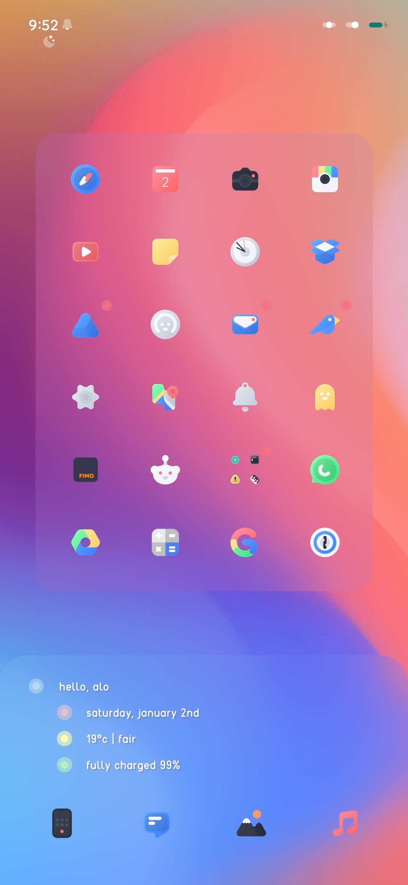
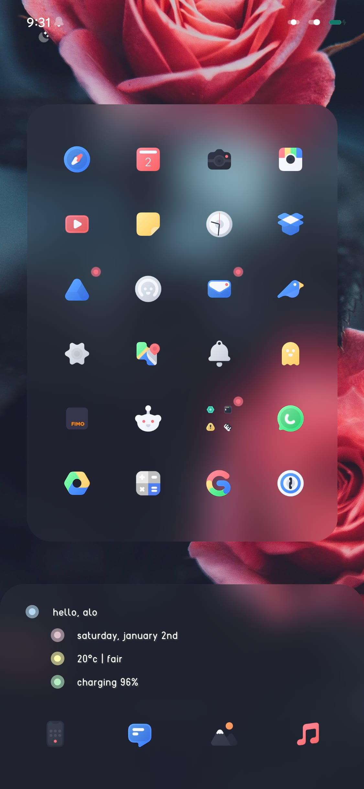
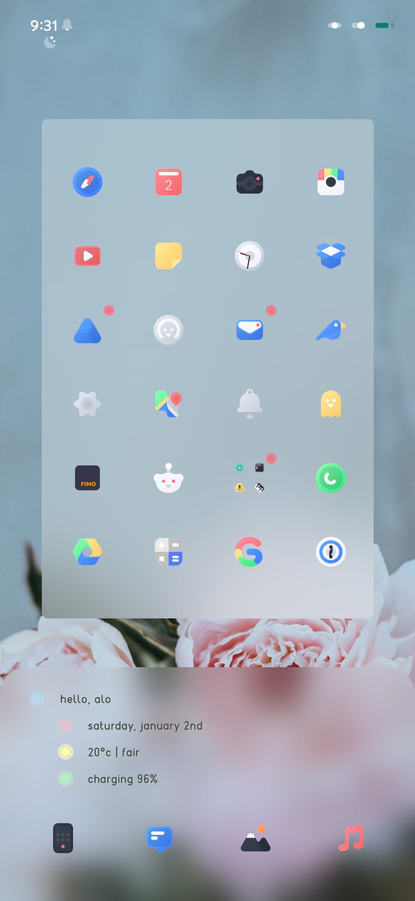

# HS | Antheia

A sleek homescreen widget

  

### Prerequesites

> A jailbroken device
>
> Xen HTML v.2.0~release

### Install

This widget can be installed from [alo.works](https://alo.works) as a part of the Antheia XenHTML Widgets package or through the deb on the Releases tab using filza or your preferred package manager.

### Customization

The following options can be configured:

- Greeting Username
- Show/Hide Weather
- Background Tint Color
- Dot Colors
- Border Radius & Blur Intensity
- Height
- Enable System Font

### Note

Please note that this widget doesn't include any themes, wallpapers, or any other modifications that may appear in the preview screenshots. Also, the other widget featured in the screenshots is HS | Blur Box; it's available at [alo.works](https://alo.works).
